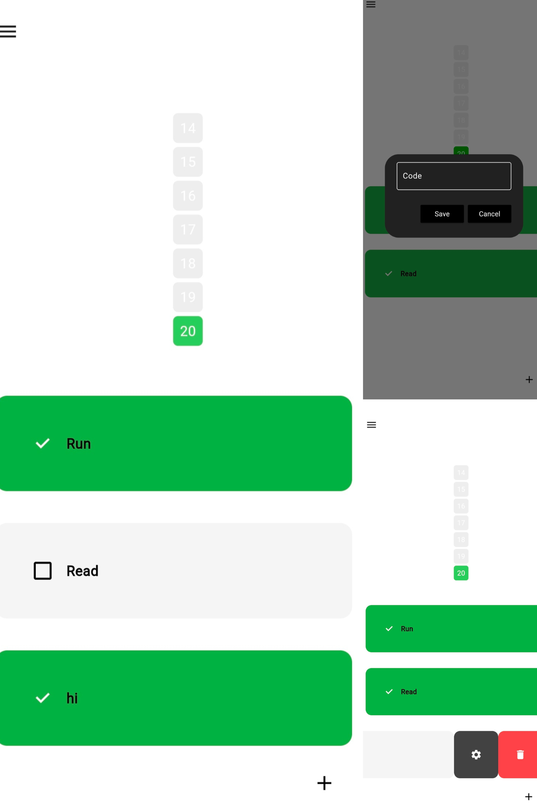

# Habit Tracker

A new Flutter project designed to help you track your habits and visualize your progress using a heatmap.

## Getting Started

This project is a starting point for a Flutter application that tracks your habits and displays their history in a heatmap format.

## Features

- Add new habits
- Track daily progress for each habit
- View habit history using a heatmap
- User-friendly interface

## Screenshots




## Installation

To get started with this project, follow these steps:

1. Clone the repository:
    ```bash
    git clone https://github.com/RohitShalgar4/Habit_TrackerFlutter.git
    ```

## Resources

If this is your first Flutter project, here are some resources to get you started:

- [Lab: Write your first Flutter app](https://docs.flutter.dev/get-started/codelab)
- [Cookbook: Useful Flutter samples](https://docs.flutter.dev/cookbook)

For help getting started with Flutter development, view the [online documentation](https://docs.flutter.dev/), which offers tutorials, samples, guidance on mobile development, and a full API reference.

## Usage

1. Open the app and navigate to the "Add Habit" screen to create a new habit.
2. Mark your progress each day by tapping on the habit.
3. View your habit history in the heatmap, which provides a visual representation of your progress over time.

## Contributing

If you would like to contribute to this project, please fork the repository and create a pull request. We welcome all contributions!
